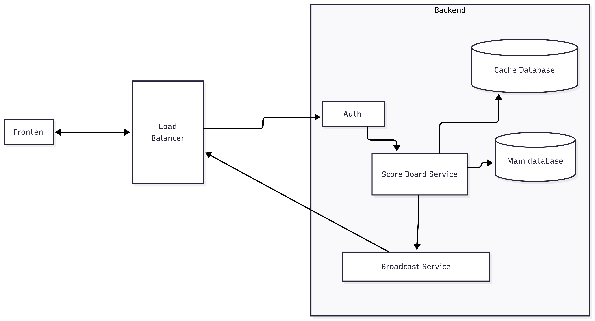
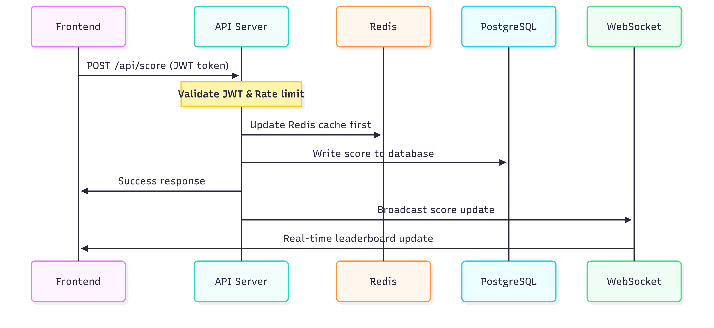
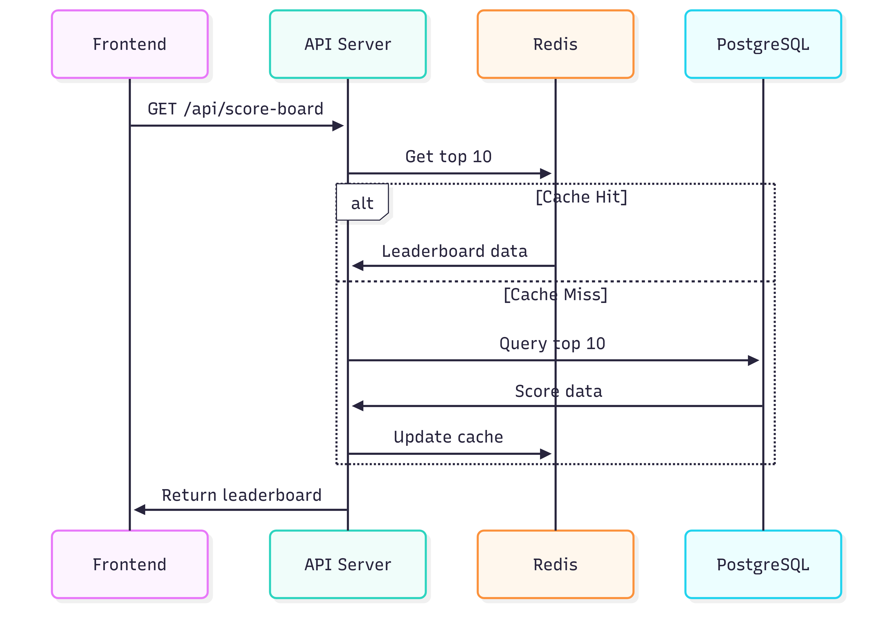

# Task

Write the specification for a software module on the API service (backend application server).

1. Create a documentation for this module on a README.md file.
2. Create a diagram to illustrate the flow of execution.
3. Add additional comments for improvement you may have in the documentation.
4. Your specification will be given to a backend engineering team to implement.

### Software Requirements

1. We have a website with a score board, which shows the top 10 user’s scores.
2. We want live update of the score board.
3. User can do an action (which we do not need to care what the action is), completing this action will increase the user’s score.
4. Upon completion the action will dispatch an API call to the application server to update the score.
5. We want to prevent malicious users from increasing scores without authorisation.

# Design document

## Requirements

- Show top 10 user score.
- Live update.
- User can update score based on whatever action.
- Prevent malicious actions.
- Fast query and update

## Architecture

### System Components

- **REST API Service**: For handling users score board request
- **Broadcast Service**: Real-time bidirectional communication (possible options are Websocket, Socket.io)
- **PostgreSQL**: Persistent storage for user profiles and score history
- **Redis**: Cache layer and real-time data store using sorted sets
- **Load Balancer**: Scaling application to multiple instances

### Storage Strategy

- **Write-through caching**: All score updates write to Redis cache first, then PostgreSQL
- **Redis sorted sets**: Maintain real-time top 10 leaderboard for fast reads

## Security

- \*\*\*Authentication & Authorization: JWT tokens required for score update operation, only valid users can update
- Rate Limiting: limit amount of requests a user can make to avoid abuse
- Validate request input: since we do not care what action user take, this is not needed yet

## API Endpoints

- `POST /api/score`: for user to update their score
- `GET /api/score-board`: get score of top 10 users
- Websocket `/ws/score`: broadcast score changes to all connected clients

# Flow diagrams

## Score Update Sequence Flow

## Top 10 Score Query Sequence Flow

# Possible Improvements

## Features

- **Bigger Scoreboard**: Allow querying beyond the top 10 users
- **Type of Actions**: Different actions should reward different amount of points
- **Validation**: Define and validate type of valid actions

## Audit & Monitoring

- **Action History**: Track all user actions with timestamps, IP addresses, and score changes for audit trails if needed
- **User Analytics**: Track engagement metrics, popular actions, and usage patterns
- **Automatic Backup**: Automated backup for database
- **System Monitoring**: Track system performance metrics, traces, logs. This will be used for better debugging as well as finding bottlenecks for optimization

## Performance & Scalability

- **Message Queue**: Use Redis Pub/Sub or a queue to handle burst traffic and prevent database overload
- **Rate Limiting**: Add IP-based rate limit and custom limit by second, minutes, hour to prevent abuse. We need to measure and track user's usage to determine the approriate limits.

# Notes

I chose Redis and PostgreSQL for data storage. Although they are solid choices, but in a real scenario, we should choose what type of database we should use based on how many requests there will be, what kind of other data we need to store beside user score.
